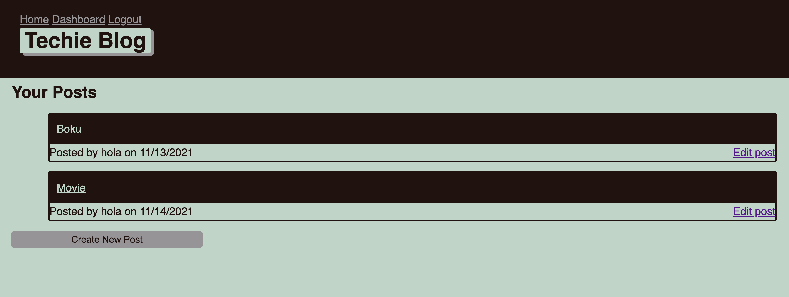

    
    
    
    
    
    
    
    
    
    

# Techies... the blog 🧑🏻‍💻

Techies is a technology-oriented blog (a-la-reddit) where multiple users can create blog-posts to share with the community.

## Quirks 🎯

The posts created can be edited and deleted from the dashboard.

The logged in session will automatically log out after a couple of minutes for your safety.

## Preview 👀 

## License 📓
[MIT](https://choosealicense.com/licenses/mit/)